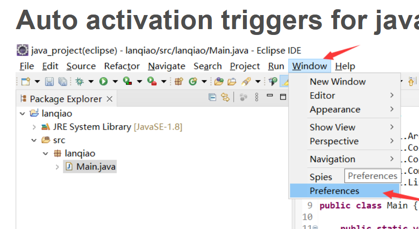

### 自动补全
操作步骤：window - >Perferences - >Java -> Editor -> Content Assist  
Auto activation triggers for java 参数 填写**.(){}abcdefghijklmopqrstuvwxyz**  

### 一些快捷键

操作步骤：**Window - >Preferences -> General -> Keys**

quick fixed available（快速修复错误): 光标放在出错的代码位置，然后**ctrl+1**，在按**enter**键，即可快速智能修复。 

代码编辑区缩放，类似我们常用的快捷键组合Ctrl+鼠标滚轮。eclipse中（笔记本）使用Ctrl+ -代码编辑区缩小，Ctrl+=放大。效果如下

另一个在 IDE 中常用的功能就是代码格式化，快捷键是「Ctrl+Shift+F」所以也可以选择 Source→Format 进行格式化。

### Eclipse字体调整

字体大小调整

Window -> Preferences -> General -> Appearence -> Colors And Fonts -> Java -> Java Editor Text Font -> Edit (在右侧)：

主题更改：

Window -> Preferences -> General -> Appearence